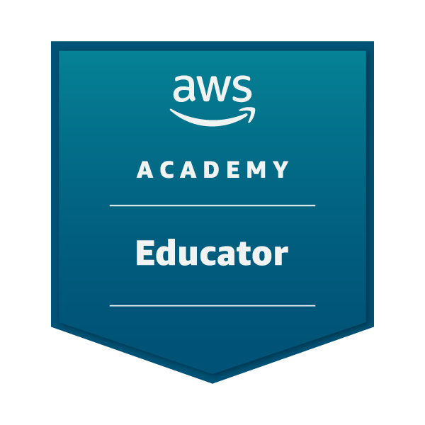
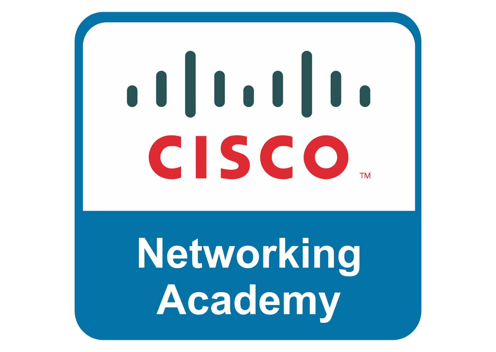

<h1>Hi there 👋</h1>

My name is Mr. Coxall and I'm the Computer Science teacher at <a href="http://mths.ca">St. Mother Teresa HS</a>, Ottawa, Canada.

<h2>🕸️ Course Websites</h2>

  <a href="https://sites.google.com/ocsb.ca/teh-icd2or">ICD2O</a>
  <a href="https://sites.google.com/ocsb.ca/teh-ics3ur">ICS3U</a>
  <a href="https://sites.google.com/ocsb.ca/teh-ics4ur">ICS4U</a>

  <a href="https://sites.google.com/ocsb.ca/teh-tej2or">TEJ2O</a>
  <a href="https://sites.google.com/ocsb.ca/teh-tej3m1">TEJ3M</a>
  <a href="https://sites.google.com/ocsb.ca/teh-tej4m1">TEJ4M</a>

<h2>✍ Programming Languages</h2>

  
  
  
  
  
  
  
  
  
  
  
  
  

<h2>💻 Operating Systems</h2>

  
  
  
  
  
  

## 🔧 Tools

  
  
  
  
  
  
  
  
  
  
  
  
  

## 📺📝 My Online Textbook - Computer Based Problem Solving

## 🎮🐢 My MakeCode Arcade Extension - Turtle Logo

## 📺📝 My YouTube Playlists about Coding

## 🏅 Awards & Affiliations

## 👥💻 Social Coding

